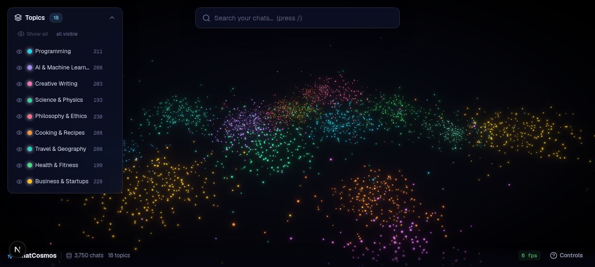
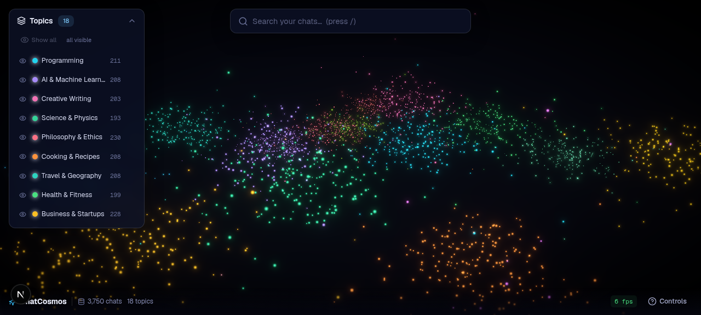
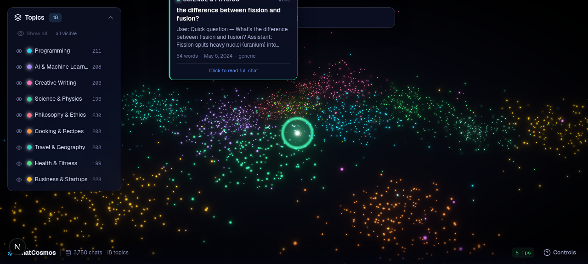
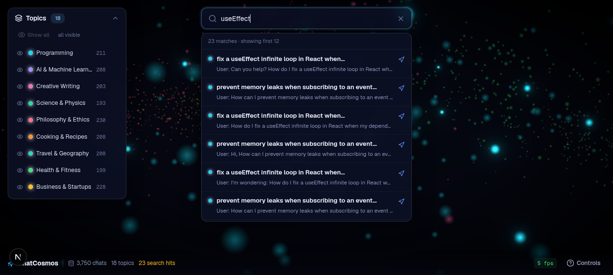
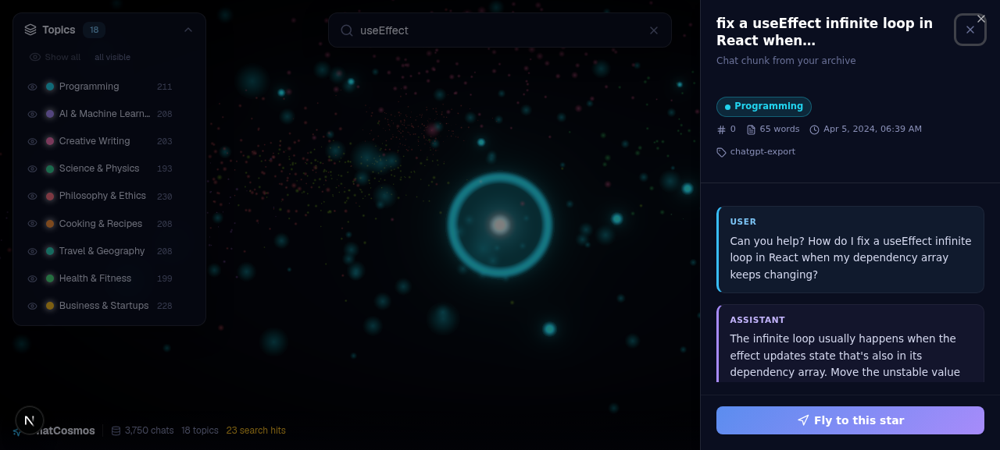
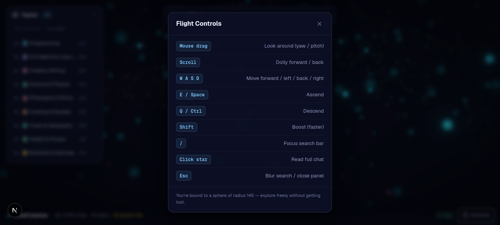
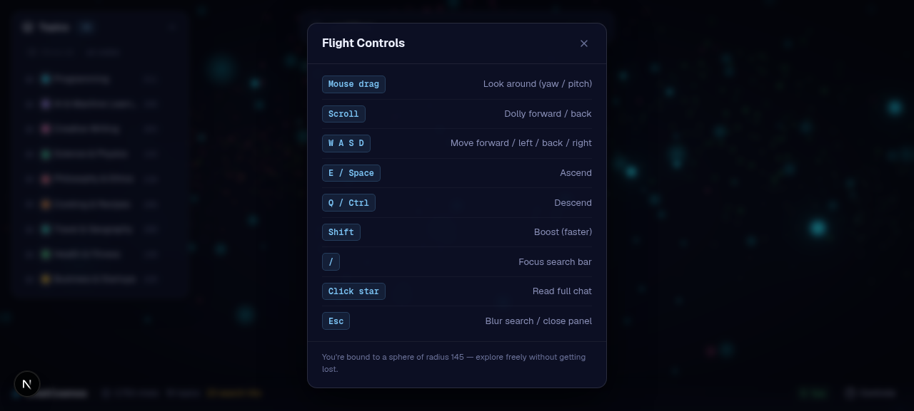

# 🌌 ChatCosmos

**Fly through your AI chat history as a 3D galaxy of stars.**

ChatCosmos ingests thousands of AI conversations (from ChatGPT, Claude, etc.), extracts their semantic meaning, clusters them by topic, and projects them into a navigable 3D space. Each chat becomes a glowing star; topics form constellations. You fly through your own thoughts with WASD + mouse, click any star to read the original conversation.



---

## ✨ Features

- **🌌 3D point-cloud galaxy** — thousands of chats rendered as glowing stars via a custom GLSL shader (soft glow, twinkle, depth fog) with additive blending + Bloom postprocessing.
- **🧭 Semantic clustering** — HDBSCAN groups similar conversations; UMAP projects high-dimensional embeddings into 3D coordinates. Each cluster gets a distinct color and TF-IDF topic label.
- **🚀 First-person flight controls** — WASD/arrows to move, mouse-drag to look, wheel to dolly, Shift to boost, E/Q to ascend/descend. Smoothed velocity (momentum) for a gliding feel.
- **🛰️ Spherical boundary** — camera is clamped to a shell `[4, 145]` units so you never get lost in empty space.
- **🔍 Instant search** — type a keyword, matching stars brighten while the rest dim; click a result to fly the camera to that star.
- **💬 Hover tooltips & detail panel** — raycaster detects stars under the cursor; hover shows a preview card, click opens the full chat in a side panel.
- **🎨 Topic legend** — toggle cluster visibility, fly to a cluster's center, see live node counts.
- **⚡ Built for scale** — single `InstancedMesh`/`Points` draw call handles 50k+ nodes; opacity updates are a single buffer pass; search runs client-side with no round-trip.

---

## 🖼️ Screenshots

### Galaxy overview
The full chat universe — 3,750 stars across 18 topic clusters, color-coded and arranged in a galaxy-disk distribution.


### Zoomed into a cluster
Fly close to see individual stars glow. Each star is one chat chunk.


### Hover tooltip
Hover any star to see its topic, title, snippet, word count, and timestamp.


### Search
Type a query — matching stars brighten, others dim. Click a result to fly there.


### Chat detail panel
Click a star to read the full conversation (user question + assistant answer), with cluster badge and metadata.


### Cluster legend
Toggle topic visibility and fly to any cluster.


### Flight controls cheatsheet
Press **Controls** in the HUD for the full keymap.


---

## 🏗️ Architecture

```
┌─────────────────────────────────────────────────────────────────┐
│                     CHATCOSMOS PIPELINE                         │
├─────────────────────────────────────────────────────────────────┤
│                                                                 │
│  [1] INGESTION (Python)          [2] EMBED + PROJECT (Python)   │
│  messy JSON chat logs  ───────►  sentence-transformers           │
│  • parse user/AI turns           • 384-dim embeddings            │
│  • normalize timestamps          • UMAP → 3D (x,y,z)             │
│  • chunk by 500 words/topic      • HDBSCAN clustering            │
│  • dedupe                        • TF-IDF topic keywords         │
│                                  • export cosmos-data.json       │
│         │                                │                       │
│         └──── sample_data/ ──────────────┘                       │
│                                                                 │
│  [3] VISUALIZATION (Next.js + R3F)   [4] FLIGHT + UI            │
│  • Points + custom glow shader       • Custom FlightControls      │
│  • Bloom postprocessing              (WASD + mouse-look +        │
│  • LOD: distance-based sizing         momentum + clamp)          │
│  • Cluster color coding              • Raycaster hover tooltip    │
│  • Frustum culling (built-in)        • Search overlay → fly-to   │
│                                      • Chat detail panel         │
│                                                                 │
└─────────────────────────────────────────────────────────────────┘
```

### Data flow
1. **Python pipeline** turns exported chat logs → `cosmos-data.json` (nodes with x/y/z, clusterId, text, timestamp)
2. **Next.js API** (`/api/cosmos`) serves that JSON
3. **React app** fetches it once, builds a `THREE.Points` buffer, renders the galaxy
4. All interaction (search, hover, filter) happens client-side for instant feedback

---

## 🧰 Tech Stack

| Layer | Technology |
|---|---|
| **Frontend** | Next.js 16, React 19, TypeScript 5, Tailwind CSS 4, shadcn/ui |
| **3D Engine** | Three.js, @react-three/fiber, @react-three/drei, @react-three/postprocessing |
| **State** | Zustand (client state), TanStack Query (server state) |
| **Backend/Data** | Python 3, Pandas, sentence-transformers, UMAP, HDBSCAN, scikit-learn |
| **Data transfer** | Pre-processed JSON (minified, ~2.6 MB for 3,750 nodes) |

---

## 🚀 Quick Start

### Option A — Run with the demo dataset (no Python needed)

The repo ships with a pre-built demo galaxy (`public/data/cosmos-data.json`, 3,750 synthetic chats across 18 topics).

```bash
git clone <your-repo-url>
cd chatcosmos
bun install
bun run dev
```

Open `http://localhost:3000` and fly through the galaxy.

### Option B — Run on your real chat history

1. **Export your chats** from ChatGPT (`Settings → Data controls → Export`) or Claude.
2. **Run the Python pipeline** (see [python-pipeline/README.md](python-pipeline/README.md) for full details):

   ```bash
   cd python-pipeline
   pip install -r requirements.txt
   python run_pipeline.py --input ./your-exports --output ../public/data/cosmos-data.json
   ```

3. **Start the frontend** — it auto-loads your real galaxy.

---

## 🎮 Controls

| Input | Action |
|---|---|
| **Mouse drag** | Look around (yaw / pitch) |
| **Scroll wheel** | Dolly forward / back |
| `W` `A` `S` `D` | Move forward / left / back / right |
| `E` / `Space` | Ascend |
| `Q` / `Ctrl` | Descend |
| `Shift` | Boost (faster) |
| `/` | Focus the search bar |
| **Click star** | Open the full chat in the detail panel |
| `Esc` | Blur search / close panel |

---

## 📁 Project Structure

```
chatcosmos/
├── python-pipeline/              # Standalone preprocessing (Steps 1 & 2)
│   ├── ingest.py                 # Parse + clean + chunk chat logs
│   ├── embed_cluster.py          # Embed + UMAP + HDBSCAN + export
│   ├── run_pipeline.py           # Orchestrator
│   ├── requirements.txt
│   ├── sample_data/              # Messy test fixture
│   └── README.md                 # Full pipeline docs
│
├── scripts/
│   └── generate-cosmos-data.ts   # Demo data generator (no ML deps)
│
├── public/data/
│   └── cosmos-data.json          # Processed dataset (demo or real)
│
├── docs/screenshots/             # App screenshots
│
└── src/
    ├── app/
    │   ├── page.tsx              # ChatCosmos entry (dynamic import, ssr:false)
    │   ├── layout.tsx
    │   ├── globals.css           # Cosmos-specific styling
    │   └── api/cosmos/route.ts   # Serves the dataset
    ├── components/cosmos/
    │   ├── ChatCosmos.tsx        # Top-level orchestrator
    │   ├── CosmosScene.tsx       # R3F Canvas + lights
    │   ├── StarField.tsx         # Point cloud + custom glow shader
    │   ├── StarHighlights.tsx    # Hovered/selected star overlay
    │   ├── StarTooltip.tsx       # 3D-anchored hover card
    │   ├── FlightControls.tsx    # WASD + mouse flight camera
    │   ├── PostProcessing.tsx    # Bloom + Vignette
    │   ├── SearchOverlay.tsx     # Search + fly-to
    │   ├── ClusterLegend.tsx     # Topic visibility + navigation
    │   ├── ChatDetailPanel.tsx   # Full chat reader (Sheet)
    │   └── Hud.tsx               # Stats + FPS + controls help
    ├── hooks/use-cosmos-data.ts  # Data fetch + client-side search
    ├── lib/cosmos-types.ts       # Shared TypeScript types
    └── stores/cosmos-store.ts    # Zustand global state
```

---

## 📊 Data Format

The pipeline outputs a single JSON file:

```json
{
  "metadata": {
    "totalNodes": 3750,
    "totalClusters": 18,
    "generatedAt": "2025-01-15T12:00:00.000Z",
    "source": "demo-synthetic",
    "dateRange": { "start": "2024-01-01T00:00:00.000Z", "end": "2025-01-01T00:00:00.000Z" }
  },
  "clusters": [
    { "id": 0, "label": "Programming", "keywords": ["react","typescript","python"], "color": "#22d3ee", "count": 211 }
  ],
  "nodes": [
    {
      "id": 0,
      "x": 16.92, "y": 3.32, "z": -0.35,
      "clusterId": 0,
      "title": "fix a useEffect infinite loop in React when…",
      "snippet": "User: How do I fix a useEffect infinite loop…",
      "fullText": "User: How do I fix...\nAssistant: The infinite loop...",
      "role": "user",
      "timestamp": "2024-04-05T06:39:44.274Z",
      "wordCount": 65,
      "source": "chatgpt-export"
    }
  ]
}
```

---

## ⚡ Performance

- **50k+ nodes**: the Python pipeline uses batched embeddings (64/batch) with on-disk caching, so re-runs are fast when tuning clustering params.
- **Rendering**: a single `THREE.Points` draw call renders all nodes; the custom shader computes size/glow/twinkle per-vertex. No per-frame CPU work except updating a `uTime` uniform.
- **Search**: runs entirely client-side (instant, no round-trip); results capped at 200 matches.
- **Filtering**: opacity changes (search dimming, cluster hiding) update a single `Float32Array` attribute — one buffer upload, no re-geometry.

---

## 🔧 Regenerating the Demo Data

If you want a fresh synthetic galaxy (different seed, more/fewer nodes):

```bash
bun run scripts/generate-cosmos-data.ts
```

Edit the `TOPICS` array in `scripts/generate-cosmos-data.ts` to add your own topics and Q&A templates.

---

## 🗺️ Roadmap

- [ ] Timeline scrubber — animate through chats by date
- [ ] Cluster-to-cluster hyperjump routes
- [ ] Export starred conversations as a reading list
- [ ] Multi-user shared flights (WebSocket)
- [ ] Real embeddings via the browser (WebGPU) for live ingestion

---

## 📄 License

MIT — see [LICENSE](LICENSE).

---

## 🙏 Acknowledgements

Built with [Next.js](https://nextjs.org), [React Three Fiber](https://docs.pmnd.rs/react-three-fiber), [Three.js](https://threejs.org), [drei](https://github.com/pmndrs/drei), [postprocessing](https://github.com/pmndrs/postprocessing), [sentence-transformers](https://www.sbert.net), [UMAP](https://umap-learn.readthedocs.io), [HDBSCAN](https://hdbscan.readthedocs.io), [shadcn/ui](https://ui.shadcn.com), and [Tailwind CSS](https://tailwindcss.com).

---

*Chart your chat universe.*
